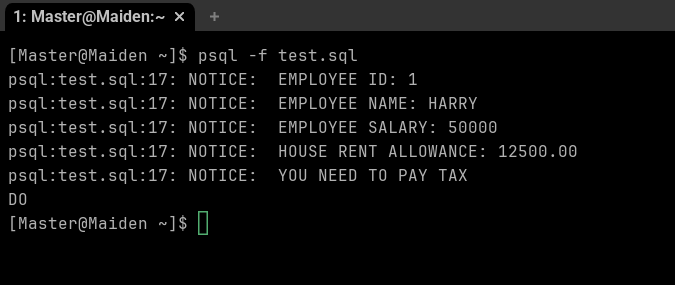

# Experiment 3 : 
1. Aim of the Session-
To understand the basic structure of a PL/SQL program by creating and executing a simple PL/SQL block that includes declaration and execution sections, and to display output using built-in procedures.

## 2. Objective of the Session
To create a simple PL/SQL program demonstrating Declaration Section and Execution Section.

## 3 . Problem Statement:
Design and implement a simple PL/SQL program that demonstrates the basic structure of a PL/SQL block. The program should include a declaration section to define variables and an execution section to perform operations using those variables and display the results using appropriate output statements.

### 4. Theory :
PL/SQL (Procedural Language/SQL) is Oracle’s procedural extension to SQL.
A PL/SQL program is divided into three sections:
1.	Declaration Section – used to declare variables and constants
2.	Execution Section – contains executable statements
3.	Exception Section (optional) – handles runtime errors
In this experiment, a simple PL/SQL block is used to demonstrate variable declaration, computation, and output display.

### 5.Software Requirements
•	Database Management System: Oracle Database
•	Database Administration Tool: Oracle Live SQL 

### 6. Experiment Steps
1.	Open Oracle Live SQL / SQL Developer
2.	Declare required variables in the declaration section
3.	Perform calculations in the execution section
4.	Display output using DBMS_OUTPUT.PUT_LINE
5.	Execute the PL/SQL block
6.	Observe the output in the DBMS output window

## Declaration Section (DECLARE)
•	Variables are declared and initialized:

o	emp_id → Employee ID
o	emp_name → Employee Name
o	emp_salary → Employee Salary

## Execution Section (BEGIN ... END)
•	DBMS_OUTPUT.PUT_LINE is used to display output.
7.	Procedure of the Practical:
1.	Start the system and open the Oracle database environment.
2.	Write a PL/SQL block starting with the DECLARE keyword.
3.	Declare variables such as employee ID, employee name, and salary.
4.	Use the BEGIN section to perform calculations like bonus and total salary.
5.	Display the output using DBMS_OUTPUT.PUT_LINE.
6.	End the block using END; followed by / to execute it.
7.	Verify the output displayed in the DBMS output panel.

## Program Code ##
 declare
    -- declaration of the variables --
    emp_id       number := 101;
    emp_name     varchar2(50):= 'Arnav';
    emp_salary   number := 50000;
    bonus        number;
    total_salary number;

-------------------------------------------
begin
    -- calculate bonus --
    bonus := emp_salary * 0.10;
    -- total salary --
    total_salary := emp_salary + bonus;

-------------------------------------------
    -- OUTPUT --
    dbms_output.put_line('Employee Details');
    dbms_output.put_line('----------------------');
    dbms_output.put_line('Employee ID          :'|| emp_id);
    dbms_output.put_line('Employee Name        :'|| emp_name);
    dbms_output.put_line('Employee Base Salary :'||emp_salary);
    dbms_output.put_line('Bonus given (10%)    :'|| bonus);
    dbms_output.put_line('Total Salary         :'||total_salary);
end;

## 8. Output:
The program successfully displays employee details, bonus amount, and total salary using DBMS output.

## 9.Result
The PL/SQL program was executed successfully. Variables were declared in the declaration section, calculations were performed in the execution section, and output was displayed using DBMS_OUTPUT.PUT_LINE.

## 10.Learning Outcomes
After completing this experiment, the student is able to:
•	Understand the basic structure of a PL/SQL program
•	Declare and initialize variables in PL/SQL
•	Perform arithmetic operations in PL/SQL
•	Display output using built-in PL/SQL procedures
•	Execute a PL/SQL block successfully in Oracle

