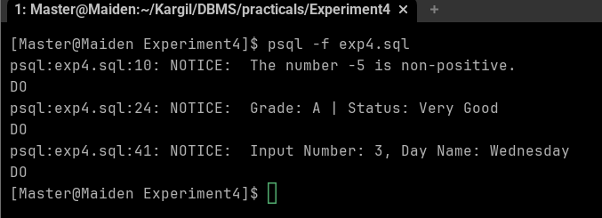

# Experiment 4: PL/SQL Conditional Control Statements

## Name: Rishav Giri
## UID: 24BAI70369
## Course: BE-CSE (AI&ML)
## Subject: Database Management System

## 1. Aim of the Session
To design and implement PL/SQL programs utilizing conditional control statements such as IF–ELSE, ELSIF, ELSIF ladder, and CASE constructs in order to control the flow of execution based on logical conditions and to analyze decision-making capabilities in PL/SQL blocks.
## 2. Software Requirements
•	Database: Live oracle
•	Database Administration Tool: pgAdmin

## 3. Objective of the Session
To implement control structures in PL/SQL (IF-ELSE, ELSE-IF, ELSE-IF LADDER, CASE STATEMENTS in PL-SQL BLOCK) to handle procedural logic within the database environment.

## 4. Practical / Experiment Steps
The work was carried out through the following activities:
1.	Program Structure Definition: Designed basic PL/SQL blocks (anonymous blocks using DO statements) consisting of declaration and execution sections.
2.	Variable Declaration: Declared required variables (Integer, Varchar) in the DECLARE section to store input values for testing conditions.
3.	Logic Implementation: Wrote executable statements using IF-THEN-ELSE, ELSIF, and CASE constructs to perform logical operations.
4.	Output Display: Used the RAISE NOTICE procedure to display results and formatted messages to the console.
5.	Execution and Verification: Executed the code in the pgAdmin Query Tool and verified the outputs against expected logical results.

## 5. Procedure of the Practical
1.	Environment Initialization: Opened pgAdmin and connected to the PostgreSQL server.
2.	Session Configuration: Ensured the "Messages" tab was visible to view RAISE NOTICE outputs.
3.	Program Preparation: Formatted the block using DO $$... END$$; syntax.
4.	Variable Setup: Assigned test values to variables (e.g., marks, numbers, or day IDs) in the declaration section.
5.	Logic Execution: Implemented conditional branches to evaluate the declared variables.
6.	Output Handling: Added notification triggers for each logic branch.
7.	Result Verification: Ran the scripts and documented the performance of each conditional construct.

## 6. I/O Analysis (Input / Output Analysis)
Query 1: IF–ELSE (Check Positive/Non-Positive)
DECLARE
    num INTEGER := -5;
BEGIN
    IF num > 0 THEN
        DBMS_OUTPUT.PUT_LINE('The number ' || num || ' is positive.');
    ELSE
        DBMS_OUTPUT.PUT_LINE('The number ' || num || ' is non-positive.');
    END IF;
END;

 
Query 2 & 3: ELSIF Ladder (Student Grading & Performance)

DECLARE
    marks INTEGER := 85;
BEGIN
    IF marks >= 90 THEN
        DBMS_OUTPUT.PUT_LINE('Grade: A+ | Status: Excellent');
    ELSIF marks >= 80 THEN
        DBMS_OUTPUT.PUT_LINE('Grade: A | Status: Very Good');
    ELSIF marks >= 60 THEN
        DBMS_OUTPUT.PUT_LINE('Grade: B | Status: Satisfactory');
    ELSE
        DBMS_OUTPUT.PUT_LINE('Grade: F | Status: Needs Improvement');
    END IF;
END;

Query 4: CASE Statement (Day of the Week)
DECLARE
    day_num  INTEGER := 3;
    day_name VARCHAR2(20);
BEGIN
    day_name :=
        CASE day_num
            WHEN 1 THEN 'Monday'
            WHEN 2 THEN 'Tuesday'
            WHEN 3 THEN 'Wednesday'
            WHEN 4 THEN 'Thursday'
            WHEN 5 THEN 'Friday'
            WHEN 6 THEN 'Saturday'
            WHEN 7 THEN 'Sunday'
            ELSE 'Invalid Day Number'
        END;

    DBMS_OUTPUT.PUT_LINE(
        'Input Number: ' || day_num || ', Day Name: ' || day_name
    );
END;

 

## 7. Learning Outcome
•	Understood the implementation of conditional branching in PostgreSQL's PL/pgSQL.
•	Learned the syntax differences between Oracle and PostgreSQL (e.g., using RAISE NOTICE instead of DBMS_OUTPUT).
•	Gained proficiency in using ELSIF ladders for multi-condition evaluations.
•	Mastered the CASE statement for handling discrete value mappings efficiently.
•	Developed the ability to debug and verify procedural logic within a database administration tool.
